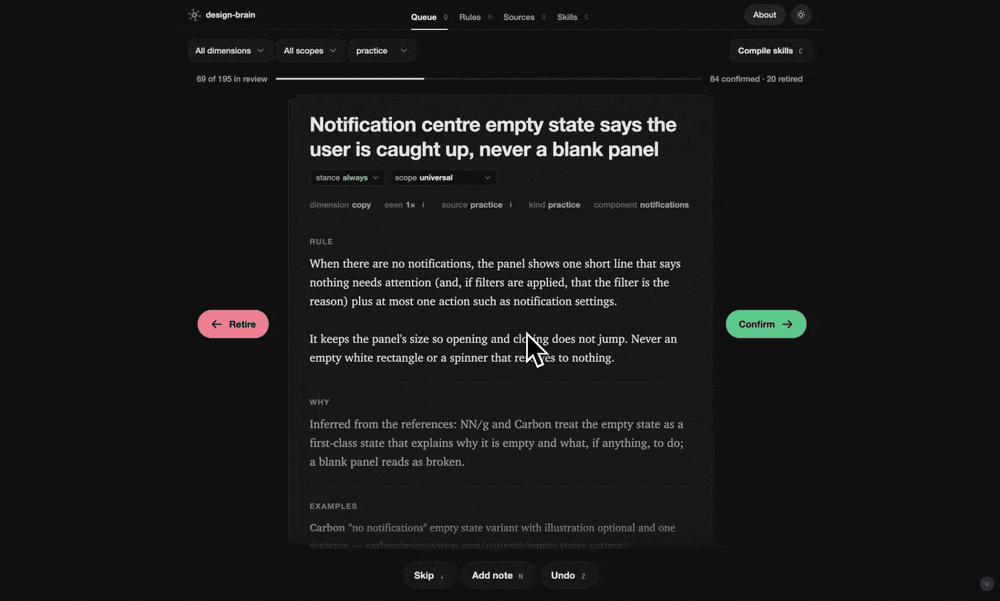
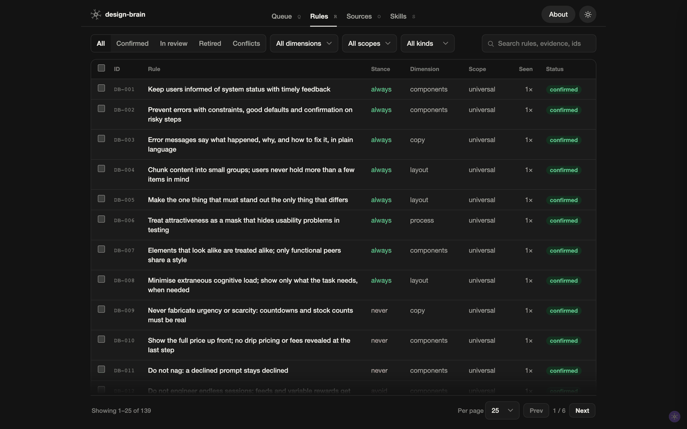
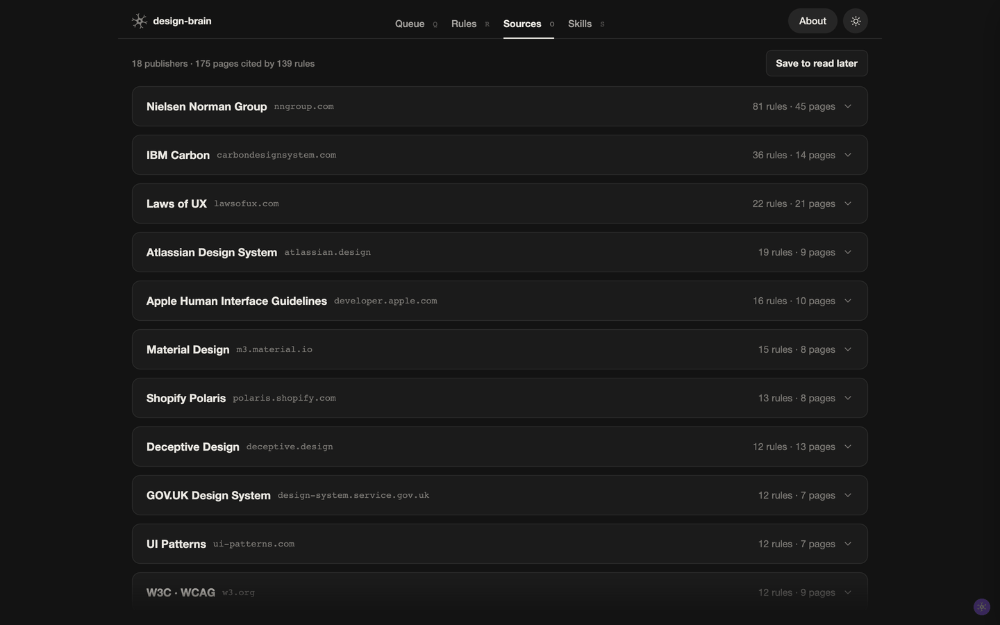
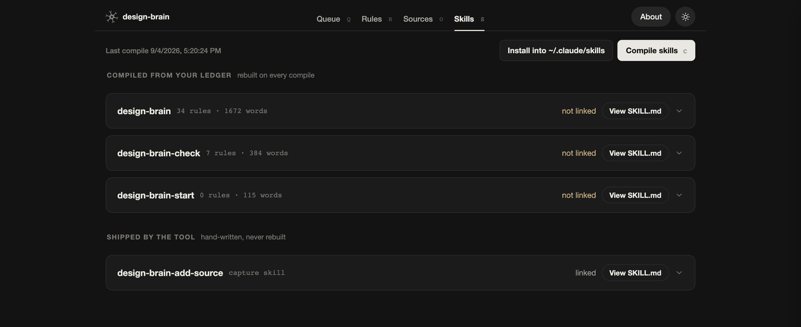

# design-brain

[](https://github.com/fabioalencar/design-brain/actions/workflows/test.yml)

Capture the design decisions you keep re-teaching AI, review them one at a time, and
compile the ones you stand behind into agent skills that load on every project.


## What is design-brain

You correct the same things in every session. The accent belongs on one action. The CTA is
squared on this brand. The table is a table, not a mosaic of cards. None of it survives
into the next project, so you type it again.

design-brain is a ledger for those corrections. It mines what you already said and built,
turns each finding into a candidate rule with its evidence attached, and waits. You accept
or reject them one at a time. The set you accept compiles into skills an agent loads before
it proposes anything.

The unit is a rule, not a note. A rule states what to do or avoid, carries a stance
(`always`, `never`, `prefer`, `avoid`), a scope, and at least one piece of evidence: the
line you actually typed, a repo path, or the article it came from. No evidence, no
candidate.

Two things stay separate. The **tool** is this repository. A **brain** is a private data
directory it operates on, holding your rules, your evidence, and your clients. The tool
never contains one, and the skills it compiles never name a project.

## Product tour

Screens below run against a brain freshly created from the seed pack, so every rule in them
is a published heuristic, bias or component practice rather than anyone's private ledger.

### Queue



One card at a time, with its evidence. Right confirms, left retires, down skips. Stance and
scope are editable on the card before you decide, `N` leaves a dated note, and `Z` undoes.
The bar at the top counts what is left.

### Rules



The whole ledger as a sortable, paged table: confirmed, in review, retired, and the
conflicts. Filter by dimension, scope or kind, search across evidence and ids, select rows
for a bulk verdict, or open one to edit it, send it back to review, or resolve a conflict.

### Sources



Every published reference the ledger cites, grouped by publisher, with the rules each page
supports. Anything you want to read later parks here until you do.

### Skills



What compiled into each skill, section by section, with its rule and word counts and
whether it is linked into `~/.claude/skills`. Compile and install without leaving the page.

---

## Install

Requires [Bun](https://bun.sh) 1.1 or newer.

```bash
git clone https://github.com/fabioalencar/design-brain.git
cd design-brain && bun install && bun link
```

## Create a brain

```bash
design-brain init ~/design-brain-me
cd ~/design-brain-me
```

You start with **139 reference candidates**, already written and cited, waiting for your
verdict: 32 usability heuristics (Nielsen's ten, the Laws of UX stated as checkable rules,
WCAG floors), 26 biases to avoid (manipulative patterns that exploit users, and the ones
designers fall into themselves), and 81 practices for common components, covering
notifications, settings, search, data tables, sorting, filtering, modals, drawers, details
pages and more.

Nothing is accepted on your behalf. They arrive in the queue like everything else.

## Fill it

Point `sources.yaml` at your projects, marking each `personal` or `client:<slug>`. Client
work yields universal craft and constraints, never your taste. Then:

```bash
design-brain harvest:repos          # fonts, palettes, tokens, components → inventory/
design-brain harvest:transcripts    # design directives from Claude Code sessions
```

Four routes in, all landing in the same queue:

| Route                                  | What it mines                                                                                |
| -------------------------------------- | -------------------------------------------------------------------------------------------- |
| `harvest:repos`                        | tokens, palettes, fonts and component choices across your repos                              |
| `harvest:transcripts`                  | the corrections you actually typed, quoted verbatim                                          |
| `templates/external-extract-prompt.md` | a read-only prompt to run on a repo you cannot share; drop its output into `inbox/_imports/` |
| `design-brain-add-source` skill        | an article or guideline page you just read, cited back to its page                           |

## Decide

```bash
design-brain review                 # http://localhost:4455
```

Four tabs:

- **Queue.** One card at a time. Swipe, or use the arrows: right confirms, left retires,
  down skips. Adjust stance and scope on the card before deciding, leave a dated note, undo
  with `Z`. Every card carries its evidence: the line you actually typed, the repo path,
  the article it came from.
- **Rules.** The whole ledger as a sortable, paged table: confirmed, in review, retired,
  and the conflicts. Select rows for bulk verdicts, or open one to edit it, move it back to
  review, or resolve a conflict.
- **Sources.** Every published reference the ledger cites, grouped by publisher, with the
  rules each page supports. Park links here to read later.
- **Skills.** What compiled into each skill, section by section, and whether it is linked
  into `~/.claude/skills`. Compile and install from here.

## Use

```bash
design-brain compile                # skills/ and exports/ from the confirmed decisions
design-brain install                # symlink them into ~/.claude/skills
```

Three skills come out of your ledger:

- **`design-brain`.** Your standing defaults, grouped by universal craft, your own taste,
  each client, and by component. Loads whenever a task touches UI.
- **`design-brain-check`.** The named failure patterns to detect: what each looks like, and
  the fix in a line. Run before calling UI work done.
- **`design-brain-start`.** Project kickoff. Establishes scope, starts from what you have
  built before, and states the non-negotiables.

Plus one the tool ships hand-written, **`design-brain-add-source`**, which turns something
you just read into candidates.

Compile also writes `exports/`: a gstack `taste-profile.json`, a `learnings.jsonl`, and a
`CLAUDE.md` snippet for a new project.

## The rules the tool keeps

Enforced, not aspirational:

- **A brain is private.** The tool repo never contains one, and names no client.
- **Candidates never self-accept.** Every harvester writes `status: candidate`. Only you
  confirm, in the queue or with `design-brain confirm`.
- **Compiled skills are project-agnostic.** No project name, path, quote or
  project-specific value leaves the ledger; a guard re-reads the output on every compile
  and reports any leak.
- **Evidence is mandatory.** No source, no candidate. Quotes stay verbatim, in the language
  you typed them.
- **Conflicts are declared, then resolved.** Two confirmed rules that disagree stop the
  compile until one of them says which wins, and when.
- **Titles are two lines; bodies read in short paragraphs.** `check` enforces the first and
  warns on the second.
- **Provenance is a field.** Ids are allocated, never meaningful.

## What it reads, and where it goes

Everything stays on your machine.

- `harvest:repos` reads the repositories listed in your `sources.yaml`, and only those:
  token files, stylesheets and component sources. It writes what it finds to `inventory/`
  inside the brain.
- `harvest:transcripts` reads your Claude Code session transcripts under
  `~/.claude/projects`, again only for the projects in `sources.yaml`. It keeps the lines
  you typed, not the agent's replies.
- The review app listens on `127.0.0.1` and is not reachable from the network.
- The tool makes no network requests. Nothing you harvest or decide leaves the machine
  unless you push the brain somewhere yourself.

## Commands

```
init <dir>            create a brain seeded with the reference pack
review                the review app
check                 validate inbox/, decisions/, patterns/
compile               build skills/ and exports/ from the confirmed decisions
harvest:repos         design facts from the projects in sources.yaml
harvest:transcripts   design directives from Claude Code transcripts
add <staged.json>     write staged candidates into inbox/
confirm|retire|restore <DB-c-###> …
rescope <id> <scope>  |  note <id> <text>
install [dir]         symlink the skills into ~/.claude/skills
```

Every command takes `--brain <dir>`, or reads `$DESIGN_BRAIN`, or uses the current
directory.

## Working on the tool

```bash
bun test scripts/          # 71 tests, each driving a real brain in a temp directory
```

`brain.ts` resolves a brain and hands out its paths. `ledger.ts` owns every mutation of it
(confirm, retire, restore, edit, note, and id allocation), so the CLI and the review app
cannot diverge. `skills.ts` owns the compiled skills and the installer. `compile-skills.ts`
renders, `check.ts` validates. The review app is `review-ui.html` plus two modules in
`app/`: the API client, and the one card renderer the queue and the drawer share.

Decisions about the tool itself are recorded as DDRs in `design/decisions/`.

Contributions are welcome, and the easiest one needs no code: a heuristic or a component
practice for the seed pack, with its source cited. See [CONTRIBUTING.md](CONTRIBUTING.md).
